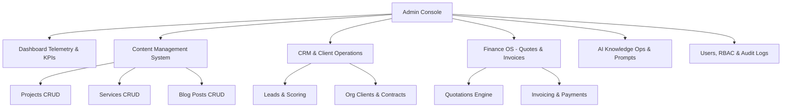

# Denis Business Platform — Admin Console Architecture Specification

```
Version: 1.0.0
Last Updated: 2026-07-25
Author: Lead Systems Architect
Reviewed By: Denis Chamkaga Operations & Engineering Team
Approval Status: APPROVED (Official Project Standard)
Related Documents: [CRM_ARCHITECTURE.md](file:///d:/Projects/denis-chamkaga-platform/docs/CRM_ARCHITECTURE.md), [KNOWLEDGE_GOVERNANCE.md](file:///d:/Projects/denis-chamkaga-platform/docs/KNOWLEDGE_GOVERNANCE.md), [API_REFERENCE.md](file:///d:/Projects/denis-chamkaga-platform/docs/API_REFERENCE.md)
```

---

## 1. Purpose & Scope

The **Admin Console** is the centralized management command center for Denis Chamkaga's Digital Business Office. It provides real-time business telemetry, client CRM pipelines, CMS content publishing, AI knowledge operations, access control, and financial management.

---

## 2. Admin Console Modules & Architecture



---

## 3. Module Breakdown

### 3.1 Dashboard & Telemetry
- KPI Cards: Total Visitor Count, Active Chat Sessions, Hot Leads Count, Monthly Revenue.
- Real-Time Presence Toggle: Admin online/offline indicator for WebRTC availability.

### 3.2 Content Management System (CMS)
- Full CRUD management for: **Projects, Services, Blog Posts, Education, Certificates, Languages, FAQs, Tutorials, Roadmap Items, Partnerships**.

### 3.3 CRM & Business Operations
- **Leads Management:** View visitor lead scores, status (Cold/Warm/Hot/Converted), message history, and trigger manual conversion to Client.
- **Client Management:** Manage corporate organizations, client contacts, contracts, and shared business documents.

### 3.4 Finance OS
- **Quotations:** Create multi-item quotes, generate public token links, dispatch PDF emails, revise quotes.
- **Invoices & Payments:** Convert approved quotes into invoices, record client payments, issue credit notes.

### 3.5 AI Knowledge Operations & Prompts
- **Knowledge Base Manager:** Add, edit, test, approve, index, and rollback AI knowledge chunks ([KNOWLEDGE_GOVERNANCE.md](file:///d:/Projects/denis-chamkaga-platform/docs/KNOWLEDGE_GOVERNANCE.md)).
- **Prompt Management:** Configure system prompt templates and intent classifier rules.

### 3.6 Role-Based Access Control (RBAC) & Audit Logs
- **User Management:** Create, activate/deactivate admin users, reset credentials.
- **Roles:** `ADMIN` (Full system access), `EDITOR` (CMS & Blog content), `VIEWER` (Read-only analytics).
- **Audit Logs:** Immutable event logging (`user_id`, `action`, `resource`, `ip_address`, `timestamp`).

---

## 4. Security & Future Rules

> [!CAUTION]
> ❌ All `/api/admin/*` endpoints MUST require JWT bearer token authentication with `ADMIN` role claims.  
> ❌ Destructive actions (deleting leads, deleting users, database backups) MUST generate an audit log entry.
