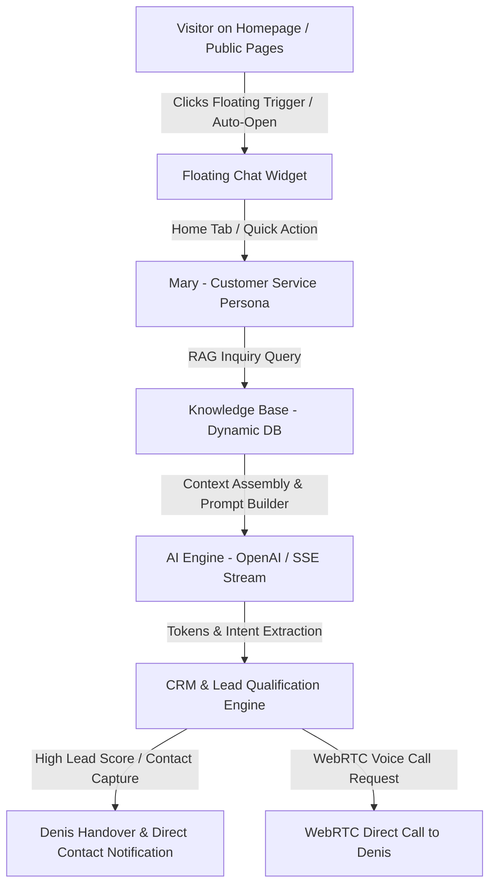
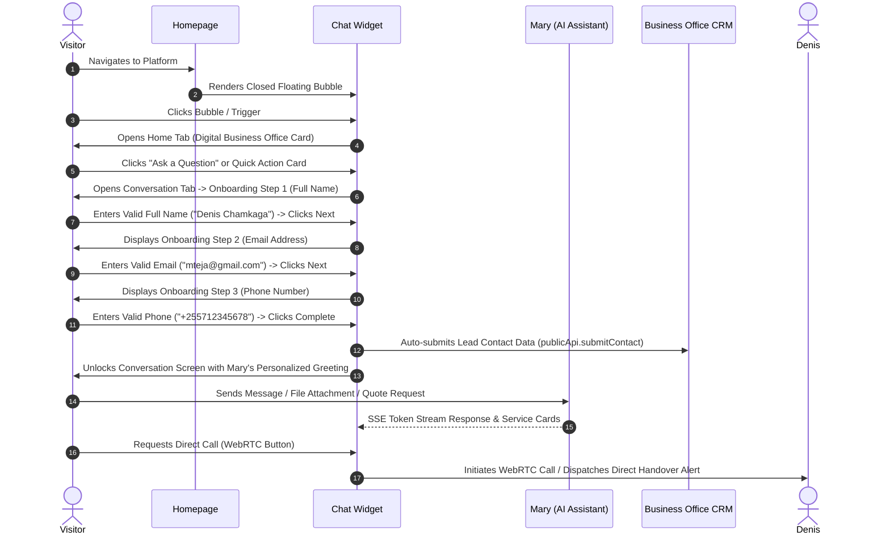
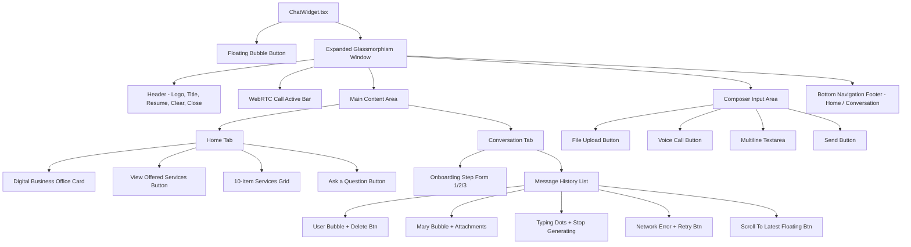
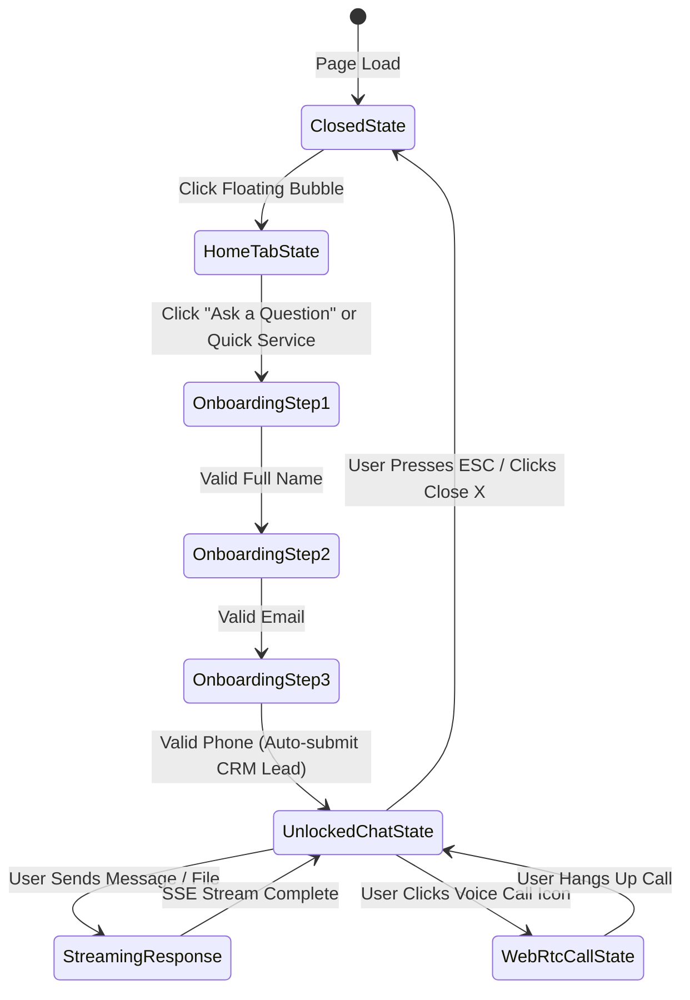

# Denis Business Platform — Chat Widget Architecture & Product Specification

> **Official Permanent Technical & Design Documentation**  
> **Repository Target:** [docs/CHAT_WIDGET_ARCHITECTURE.md](file:///d:/Projects/denis-chamkaga-platform/docs/CHAT_WIDGET_ARCHITECTURE.md)  
> **Asset Archive:** [docs/chat-widget/](file:///d:/Projects/denis-chamkaga-platform/docs/chat-widget/)  
> **Source Component:** [ChatWidget.tsx](file:///d:/Projects/denis-chamkaga-platform/frontend/src/components/organisms/ChatWidget/ChatWidget.tsx)  
> **Version:** 1.0.0 (Permanent Reference)

---

> [!IMPORTANT]
> This document is the **single source of truth** for the Denis Business Platform Chat Widget. Any pull request, architectural modification, design revision, or onboarding logic change targeting the Chat Widget **must be reviewed against this document** before being approved and merged into Git.

---

## Table of Contents

1. [Product Purpose](#1-product-purpose)
2. [Architecture Overview](#2-architecture-overview)
3. [Product Principles](#3-product-principles)
4. [Customer Journey](#4-customer-journey)
5. [Onboarding Flow](#5-onboarding-flow)
6. [UI Layout](#6-ui-layout)
7. [UX Rules](#7-ux-rules)
8. [State Management](#8-state-management)
9. [AI Flow](#9-ai-flow)
10. [Security](#10-security)
11. [Responsive Behaviour](#11-responsive-behaviour)
12. [Design System](#12-design-system)
13. [Component Tree](#13-component-tree)
14. [Future Development Rules](#14-future-development-rules)
15. [Change Log](#15-change-log)
16. [UI Wireframes](#16-ui-wireframes)
17. [High-Fidelity Mockups](#17-high-fidelity-mockups)
18. [Interactive Prototype Flow](#18-interactive-prototype-flow)
19. [Design Language](#19-design-language)
20. [Visual Assets Inventory](#20-visual-assets-inventory)
21. [Component Design Rules](#21-component-design-rules)
22. [Design Decisions](#22-design-decisions)
23. [Screenshot Archive](#23-screenshot-archive)

---

## 1. Product Purpose

### 1.1 Why the Chat Widget Exists
The **Denis Business Platform Chat Widget** serves as the central intelligent interface connecting website visitors, potential clients, and enterprise partners directly with Denis Chamkaga's Digital Business Office. Rather than forcing visitors through static static contact forms or traditional email inquiries, the widget delivers an immediate, AI-driven, interactive consultation experience.

### 1.2 Primary Customer Entry Point
The Chat Widget is embedded globally across all public pages via [PublicLayout.tsx](file:///d:/Projects/denis-chamkaga-platform/frontend/src/components/templates/PublicLayout/PublicLayout.tsx). It acts as the primary top-of-funnel customer entry point because:
- **Instant Response Time:** Visitors receive real-time answers regarding services, tech stack, pricing, and project availability.
- **Lead Capture Efficiency:** Captures zero-party data (Full Name, Email, Phone) during conversation entry rather than requiring passive form completion.
- **Seamless Engagement:** Provides context-aware quick action cards (Web development, Mobile apps, AI solutions, ERP/CRM, Cloud, Consultation) directly on the Home tab.

### 1.3 Relationship with Denis Assistant (Mary)
- **Persona:** Mary is Denis Chamkaga's official AI Business Assistant.
- **Bilingual Capabilities:** Communicates in Swahili (`sw`) and English (`en`).
- **Core Function:** Answers inquiries, qualifies leads, captures contact details, calculates initial quotes, and escalates serious project leads to Denis Chamkaga.

### 1.4 Relationship with the Digital Business Office
The Digital Business Office represents the entire backend infrastructure of Denis Chamkaga's platform (CRM, Finance OS, Calendar, Knowledge Base, and WebRTC Voice Calling). The Chat Widget feeds real-time visitor metadata and conversation events into this ecosystem:
- **CRM Integration:** Completed onboarding automatically dispatches a new lead record via `publicApi.submitContact()`.
- **Finance OS:** High-intent inquiries (e.g., requesting quotations) trigger automated quote draft requests.
- **WebRTC Voice Calling:** High-value visitors can initiate direct audio calls directly inside the widget.

---

## 2. Architecture Overview

### 2.1 System Component Flow Diagram



### 2.2 End-to-End Data Pipeline
1. **Frontend Interface:** [ChatWidget.tsx](file:///d:/Projects/denis-chamkaga-platform/frontend/src/components/organisms/ChatWidget/ChatWidget.tsx) manages local component state, streaming SSE buffers, WebRTC connection state, and visitor validation.
2. **API Communication Layer:** [api.ts](file:///d:/Projects/denis-chamkaga-platform/frontend/src/services/api.ts) provides `aiApi` (SSE chat stream, attachments, session history) and `publicApi` (contact submission / lead dispatch).
3. **Backend Coordinator:** `backend/src/controllers/chat.controller.ts` receives POST `/api/ai/chat/stream`, streams response tokens via Server-Sent Events (SSE), and updates Prisma database models.
4. **CRM Sync:** Contacts are saved in `chat_sessions` and `leads` database tables, triggering real-time notifications to the Admin Dashboard.

---

## 3. Product Principles

### Non-Negotiable Architectural Rules

> [!CAUTION]
> Future developers **MUST NOT** violate any of the following product principles under any circumstances.

1. **Sole Conversation Interface:**  
   The Floating Chat Widget is the **ONLY** live chat input interface on the entire platform. There must never be duplicate chat textboxes, standalone support widgets, or alternative floating forms anywhere else on the website.
2. **Unified Session Architecture:**  
   The Chat Widget and the standalone `/denis-assistant` page **MUST ALWAYS** share exact session parameters:
   - `assistantSessionId` (`localStorage.getItem('assistantSessionId')`)
   - `assistantVisitorId` (`localStorage.getItem('assistantVisitorId')`)
   - `assistantVisitorInfo` (`localStorage.getItem('assistantVisitorInfo')`)
   - Conversation history state
   - CRM lead state
3. **Zero Duplicate Sessions:**  
   Opening the chat widget on any page must resume the existing session if active (within the 30-minute inactivity threshold).
4. **Zero Duplicate Onboarding:**  
   Once a visitor completes the 3-step onboarding flow (Name, Email, Phone), the visitor information is saved in `localStorage`. The visitor **MUST NEVER** be asked to complete onboarding again on subsequent page views or widget toggles.
5. **Strict Data Validation:**  
   No message dispatch or voice call initiation is permitted until onboarding data passes strict regex and character-level validation.

---

## 4. Customer Journey



---

## 5. Onboarding Flow

The onboarding flow is a progressive 3-step interactive card rendered inside the Conversation tab whenever `visitorInfo` is missing or `onboardingStep !== 'complete'`.

```
[ Step 1: Full Name ] ──(Valid Name)──► [ Step 2: Email Address ] ──(Valid Email)──► [ Step 3: Phone Number ] ──(Valid Phone)──► [ Unlock Chat & Submit Lead ]
```

### 5.1 Onboarding Steps & Fields

| Step | Field Name | Visual Indicator | Real-Time Character Filtering | Example Placeholder |
| :--- | :--- | :--- | :--- | :--- |
| **Step 1/3** | `formFullName` | `UserCheck` icon | Digits `0-9` stripped automatically | `e.g., John Doe` / `Mfano: Denis Chamkaga` |
| **Step 2/3** | `formEmail` | `Mail` icon | Standard email character filter | `e.g., john@example.com` / `Mfano: mteja@gmail.com` |
| **Step 3/3** | `formPhone` | `Smartphone` icon | Non-phone characters `[^0-9+\s\-\(\)]` stripped | `e.g., +255 712 345 678` |

### 5.2 Strict Validation Rules (Source: [ChatWidget.tsx:L244-L332](file:///d:/Projects/denis-chamkaga-platform/frontend/src/components/organisms/ChatWidget/ChatWidget.tsx#L244-L332))

#### Full Name Validation (`validateFullName`)
- **Required:** Non-empty after trimming.
- **Regex Pattern:** `/^[a-zA-Z\u00C0-\u024F\s'-]+$/`
- **Part Count:** Must contain at least two words (first name & last name).
- **Min Part Length:** Each name segment must be at least 2 characters long.
- **Rejection:** Rejects numbers, HTML symbols, script tags, single-name inputs.

#### Email Validation (`validateEmail`)
- **Required:** Non-empty after trimming.
- **Regex Pattern:** `/^[a-zA-Z0-9._%+-]+@[a-zA-Z0-9.-]+\.[a-zA-Z]{2,}$/` (RFC 5322 standard).
- **Rejection:** Rejects invalid domains, missing `@` symbol, improper TLDs.

#### Phone Validation (`validatePhone`)
- **Required:** Non-empty after stripping spaces, hyphens, and parentheses.
- **Regex Pattern:** `/^\+?[0-9]{9,15}$/`
- **Length Limit:** Must contain between 9 and 15 numeric digits (optional leading `+`).
- **Rejection:** Rejects alphabetic input, short numbers (<9 digits), excess length (>15 digits).

---

## 6. UI Layout

The Chat Widget is constructed as a fixed overlay anchored at the bottom-right of the viewport ([ChatWidget.tsx:L800](file:///d:/Projects/denis-chamkaga-platform/frontend/src/components/organisms/ChatWidget/ChatWidget.tsx#L800)).

```
┌──────────────────────────────────────────────────────────┐
│  HEADER: Platform Logo | Title | Resume | Clear | Close  │
├──────────────────────────────────────────────────────────┤
│  WEBRTC ACTIVE CALL BAR (Appears during voice call)      │
├──────────────────────────────────────────────────────────┤
│                                                          │
│  MAIN CONTENT AREA                                       │
│  ├── HOME TAB:                                           │
│  │   ├── Branded Card (Digital Business Office Badge)    │
│  │   ├── Motto & Description (Swahili/English)           │
│  │   ├── Offered Services Switcher & 10-Item Quick Grid  │
│  │   └── "Ask a Question" Primary Button                 │
│  │                                                       │
│  └── CONVERSATION TAB:                                   │
│      ├── Onboarding Card (Step 1/2/3, Progress Bar)       │
│      ├── Chat Message History (User / Mary Bubbles)       │
│      ├── Attachment Previews & Delete Buttons            │
│      ├── Typing Indicator & "Stop Generating" Button     │
│      └── Floating "Scroll to latest" Button              │
│                                                          │
├──────────────────────────────────────────────────────────┤
│  COMPOSER INPUT AREA:                                    │
│  [Attach File] [Voice Call] [ Textarea Message... ] [Send]│
├──────────────────────────────────────────────────────────┤
│  BOTTOM NAVIGATION FOOTER:                               │
│  [ Home Tab ]                    [ Conversation Tab (•) ]│
└──────────────────────────────────────────────────────────┘
```

---

## 7. UX Rules

1. **Auto-Open Behavior:**  
   The widget opens automatically for first-time visitors after a brief page-load delay unless previously dismissed.
2. **Manual Close Behavior:**  
   Clicking the Close `X` button sets `sessionStorage.setItem('assistantWidgetClosedManually', 'true')` and collapses the widget.
3. **Session Expiration Check:**  
   If `assistantLastMessageTime` exceeds 30 minutes (30 * 60 * 1000 ms), saved session IDs are removed to ensure fresh context ([ChatWidget.tsx:L208-L215](file:///d:/Projects/denis-chamkaga-platform/frontend/src/components/organisms/ChatWidget/ChatWidget.tsx#L208-L215)).
4. **Keyboard Accessibility:**
   - Pressing **`Escape`** anywhere closes the widget.
   - Pressing **`Enter`** (without Shift) inside the textarea sends the message.
   - Pressing **`Shift + Enter`** inserts a new line.
5. **Auto-Scroll Behavior:**  
   Automatically scrolls to the bottom when new message tokens arrive, provided the user is near the bottom (<140px offset). Shows a floating "Scroll to latest" button if scrolled up.
6. **Animation Specs:**  
   Framer Motion animations for widget expansion (`scale: 0.9` to `1`, `opacity: 0` to `1`, `y: 50` to `0` over 250ms).

---

## 8. State Management

### 8.1 Browser Storage Model

| Key | Storage Type | Data Type | Purpose |
| :--- | :--- | :--- | :--- |
| `assistantVisitorId` | `localStorage` | `string` | Unique persistent visitor UUID (`visitor_xxxx`) |
| `assistantVisitorInfo` | `localStorage` | `JSON string` | `{ fullName, email, phone }` onboarding object |
| `assistantSessionId` | `localStorage` | `string` | Active backend AI session UUID |
| `assistantLastMessageTime` | `localStorage` | `timestamp` | Timestamp of last message sent for 30-min expiry |
| `assistantWidgetClosedManually` | `sessionStorage` | `boolean` | Flag preventing intrusive auto-reopening per browser tab |

### 8.2 Zustand Stores

```typescript
// useUIStore.ts
export const useUIStore = create<UIState>((set) => ({
  isChatOpen: false,
  toggleChat: (open?: boolean) => set((state) => ({ isChatOpen: open ?? !state.isChatOpen })),
}));

// useLanguageStore.ts
export const useLanguageStore = create<LanguageState>((set) => ({
  language: 'en', // 'en' | 'sw'
  setLanguage: (lang) => set({ language: lang }),
}));
```

---

## 9. AI Flow

```mermaid
graph LR
    A[Visitor Input / Attachment] --> B[guards.ts / Input Safety]
    B --> C[prompt-builder.ts]
    C -->|Inject Dynamic DB Context| D[knowledge-loader.ts]
    D --> E[OpenAI GPT API / Local Engine]
    E --> F[SSE Stream Response]
    F --> G[lead-scoring.ts]
    G -->|High Intent Terms Detected| H[publicApi.submitContact]
    H --> I[CRM Lead Record Created]
```



### 9.1 Persona & System Prompt
Mary is configured as a warm, professional, bilingual business assistant for Denis Chamkaga. She specializes in web development, mobile apps, AI solutions, ERP/CRM deployments, cloud infrastructure, and business consulting.

### 9.2 RAG Knowledge Base Integration
The backend retrieves context from database tables (`projects`, `services`, `faqs`, `ai_knowledge`) before constructing the final system prompt.

### 9.3 Lead Scoring & High-Intent Auto-Dispatch
Messages containing high-intent keywords (`quotation`, `nukuu`, `mkutano`, `meeting`, `tovuti`, `website`, `app`, `erp`, `crm`, `project`, `consultation`) automatically trigger background submission to the CRM database ([ChatWidget.tsx:L653-L663](file:///d:/Projects/denis-chamkaga-platform/frontend/src/components/organisms/ChatWidget/ChatWidget.tsx#L653-L663)).

---

## 10. Security

1. **Input Sanitization:** Strips script tags, HTML tags, and dangerous symbols before sending to the SSE endpoint.
2. **Real-Time Field Masking:**  
   - Full Name input strips all numbers (`0-9`) on typing.
   - Phone input strips all non-numeric characters except `+`, spaces, hyphens, and parentheses.
3. **File Upload Restrictions:**
   - Allowed Extensions: `.jpg`, `.jpeg`, `.png`, `.webp`, `.pdf`, `.docx`, `.xlsx`
   - Maximum File Size: **10 MB**
4. **Stream Request Safety:**  
   Uses standard JavaScript `AbortController` signals to cancel streaming requests cleanly when the user clicks "Stop Generating" or clears chat ([ChatWidget.tsx:L684](file:///d:/Projects/denis-chamkaga-platform/frontend/src/components/organisms/ChatWidget/ChatWidget.tsx#L684)).

---

## 11. Responsive Behaviour

| Viewport Category | Screen Width / Height | Widget Panel Layout |
| :--- | :--- | :--- |
| **Desktop** | `> 1024px` width | Anchored bottom-right: `w-[420px]`, `h-[620px]`, `bottom-6 right-6` |
| **Laptop** | `768px - 1024px` width | Anchored bottom-right: `w-[420px]`, `h-[620px]`, `bottom-6 right-6` |
| **Tablet** | `640px - 767px` width | Anchored bottom-right: `w-[420px]`, `h-[calc(100vh-3rem)]` |
| **Mobile** | `< 640px` width | Responsive overlay: `w-[calc(100vw-1.5rem)]`, `h-[calc(100vh-2rem)]`, `bottom-3 right-3` |
| **Small-Height Desktop** | `< 700px` height | Constrained height: `max-h-[min(620px,calc(100vh-2rem))]` |

---

## 12. Design System

- **Display Typography:** `Outfit`, `sans-serif` (`font-display`)
- **Body Typography:** `Inter`, `sans-serif` (`font-body`)
- **Primary Brand Color:** `accent-violet` (`#8B5CF6`)
- **Hover Brand Color:** `accent-violet-hover` (`#7C3AED`)
- **Glassmorphism Panel:** `glass-panel shadow-2xl dark:bg-[#0c0c0e]/95 light:bg-white/95 backdrop-blur-xl border border-accent-violet/40`
- **Border Radii:** `rounded-2xl` (Widget frame, Onboarding card), `rounded-xl` (Buttons, Inputs), `rounded-full` (Floating toggle, Avatars, Badges)
- **Icons:** `lucide-react` (MessageSquare, X, Send, User, Trash2, Phone, Home, Paperclip, Loader, HelpCircle, Briefcase, StopCircle, ArrowRight, Mail, Smartphone, UserCheck, CheckCircle2, ArrowDown, WifiOff, RefreshCw)

---

## 13. Component Tree



---

## 14. Future Development Rules

> [!CAUTION]
> Future developers **MUST NOT**:
> ❌ Add another chat form, floating box, or modal chatbot anywhere on the platform.  
> ❌ Add a second AI assistant persona (Mary is the sole assistant).  
> ❌ Modify or bypass the 3-step progressive onboarding validation logic.  
> ❌ Allow unvalidated message dispatch or voice call initiation.  
> ❌ Replace or disconnect the `assistantSessionId` / `assistantVisitorInfo` localStorage sync.  
> ❌ Modify Chat Widget visual styling or responsive dimensions without updating this document first.

---

## 15. Change Log

| Date | Developer | Version | Reason / Description | Files Changed | Approval |
| :--- | :--- | :--- | :--- | :--- | :--- |
| **2026-07-25** | AI Core Team | `1.0.0` | Initial release of permanent Chat Widget Architecture & Product Specification. | [CHAT_WIDGET_ARCHITECTURE.md](file:///d:/Projects/denis-chamkaga-platform/docs/CHAT_WIDGET_ARCHITECTURE.md) | Approved |

---

## 16. UI Wireframes

### 16.1 Closed State Wireframe
```
                                                        ┌─────┐
                                                        │ (💬)│ ◄─ Floating Toggle
                                                        └─────┘
```

### 16.2 Home Tab Wireframe
```
┌──────────────────────────────────────────────────────────┐
│ [Logo] Denis Chamkaga Business Platform    (↻) (🗑) (❌) │
├──────────────────────────────────────────────────────────┤
│ ┌──────────────────────────────────────────────────────┐ │
│ │          🟢 DIGITAL BUSINESS OFFICE                  │ │
│ │          We are here to help you!                    │ │
│ │  We help you design custom software & systems...     │ │
│ └──────────────────────────────────────────────────────┘ │
│ ┌──────────────────────────────────────────────────────┐ │
│ │ 💼 View Offered Services                             │ │
│ └──────────────────────────────────────────────────────┘ │
│ ┌──────────────────────────────────────────────────────┐ │
│ │ ❓ Ask a Question                                     │ │
│ └──────────────────────────────────────────────────────┘ │
├──────────────────────────────────────────────────────────┤
│ [ 🏠 Home ]                        [ 💬 Conversation ]   │
└──────────────────────────────────────────────────────────┘
```

### 16.3 Onboarding Step 1 (Full Name) Wireframe
```
┌──────────────────────────────────────────────────────────┐
│ [Logo] Denis Chamkaga Business Platform             (❌) │
├──────────────────────────────────────────────────────────┤
│ ┌──────────────────────────────────────────────────────┐ │
│ │ (Mary) Mary • Denis' Business Assistant        [1/3] │ │
│ │ [ ═════════════════                    ]             │ │
│ │ "Hello! Welcome... May I have your full name?"       │ │
│ │ 👤 Full Name                                         │ │
│ │ [ Denis Chamkaga                                   ] │ │
│ │ [ Next ───────────────►                            ] │ │
│ └──────────────────────────────────────────────────────┘ │
├──────────────────────────────────────────────────────────┤
│ [ 🏠 Home ]                        [ 💬 Conversation ]   │
└──────────────────────────────────────────────────────────┘
```

### 16.4 Active Conversation & Composer Wireframe
```
┌──────────────────────────────────────────────────────────┐
│ [Logo] Denis Chamkaga Business Platform    (↻) (🗑) (❌) │
├──────────────────────────────────────────────────────────┤
│ (Mary) Hello Denis! How can I assist your business today?│
│                                                          │
│        I need a quotation for a Mobile App. (User) [🗑]  │
│                                                          │
│ (Mary) I would be delighted to provide a quote for your  │
│        mobile app project!                               │
├──────────────────────────────────────────────────────────┤
│ [📎] [📞] [ Type your message to Mary...           ] [🚀]│
├──────────────────────────────────────────────────────────┤
│ [ 🏠 Home ]                        [ 💬 Conversation (•) ]│
└──────────────────────────────────────────────────────────┘
```

---

## 17. High-Fidelity Mockups

The approved high-fidelity visual layout uses a dark-mode glassmorphism theme with vibrant violet accents (`#8B5CF6`).

```
Desktop & Laptop Viewport (420px x 620px):
- Background: Glassmorphism panel dark:bg-[#0c0c0e]/95 backdrop-blur-xl
- Border: 1px solid rgba(139, 92, 246, 0.4)
- Header: Platform Logo Icon (Violet), Display Font Title, Action Icons (Resume, Clear, Esc)
- Active Call Bar: Dark zinc container with pulse ring and active timer (MM:SS)
- Onboarding Card: Rounded-2xl inner panel with Mary avatar and progress indicators
- Composer: Multiline auto-expanding textarea, file upload button, voice call icon, send button
- Navigation Footer: Equal-width tabs with bottom border highlight
```

---

## 18. Interactive Prototype Flow



---

## 19. Design Language

- **Color Tokens:**
  - `accent-violet`: `#8B5CF6` (Primary buttons, active tab border, user bubble background)
  - `accent-violet-hover`: `#7C3AED` (Button hover states)
  - `dark-bg`: `#0c0c0e` (Glassmorphism backdrop)
  - `zinc-900`: `#18181b` (Card container backdrop)
  - `green-500`: `#22c55e` (Online badge & WebRTC active state)
  - `rose-600`: `#e11d48` (End Call button)
- **Typography Scale:**
  - Header Title: `text-xs sm:text-sm font-extrabold font-display`
  - Subtitle / Badges: `text-[11px] font-semibold`
  - Body / Messages: `text-xs sm:text-sm font-body leading-relaxed`
  - Input Placeholders: `text-xs sm:text-sm font-body`
- **Elevation & Shadows:**
  - Floating Toggle: `shadow-2xl`
  - Chat Window: `shadow-2xl`
  - Cards & Buttons: `shadow-xl` / `shadow-md`

---

## 20. Visual Assets Inventory

| Asset Name | Category | Exact Repository File Path | Usage Location |
| :--- | :--- | :--- | :--- |
| **Mary Avatar** | Avatar Image | [docs/chat-widget/mary_avatar.png](file:///d:/Projects/denis-chamkaga-platform/docs/chat-widget/mary_avatar.png) | Onboarding header, Mary message bubbles, intro screen |
| **Platform Logo Icon** | SVG Component | [Logo.tsx](file:///d:/Projects/denis-chamkaga-platform/frontend/src/components/atoms/Logo/Logo.tsx) | Widget top header top-left |
| **Bot Illustration** | Graphic Asset | [docs/chat-widget/bot_illustration.webp](file:///d:/Projects/denis-chamkaga-platform/docs/chat-widget/bot_illustration.webp) | AI features showcase & promotional banners |
| **Bot Portrait** | Graphic Asset | [docs/chat-widget/bot_portrait.webp](file:///d:/Projects/denis-chamkaga-platform/docs/chat-widget/bot_portrait.webp) | Secondary assistant marketing cards |
| **Architecture Diagram** | Diagram Asset | [docs/chat-widget/architecture.webp](file:///d:/Projects/denis-chamkaga-platform/docs/chat-widget/architecture.webp) | System documentation reference |
| **Client Journey Asset** | Diagram Asset | [docs/chat-widget/client_journey.webp](file:///d:/Projects/denis-chamkaga-platform/docs/chat-widget/client_journey.webp) | Customer journey documentation reference |
| **Workflow Asset** | Diagram Asset | [docs/chat-widget/workflow.webp](file:///d:/Projects/denis-chamkaga-platform/docs/chat-widget/workflow.webp) | Process automation reference |

---

## 21. Component Design Rules

### 21.1 Header Component
- **Purpose:** Displays platform identity and quick actions (Resume, Clear, Close).
- **Variants:** Standard header; WebRTC active banner overlay.
- **Accessibility:** Close button has `aria-label="Close (Esc)"`.

### 21.2 Message Bubble Component
- **Purpose:** Displays user and assistant conversation turns.
- **User Variant:** Right-aligned, `bg-accent-violet`, `text-white`, `rounded-tr-none`.
- **Assistant Variant:** Left-aligned, `bg-zinc-800`, `text-zinc-100`, `rounded-tl-none`, includes Mary avatar.

### 21.3 Composer Input Area
- **Purpose:** Multiline input, file upload, voice call toggle, send trigger.
- **Keyboard Interaction:** `Enter` sends; `Shift+Enter` inserts line break.

---

## 22. Design Decisions

1. **Why Floating Chat Widget is the Only Chat Interface:**  
   Fragmenting customer conversations across multiple forms creates data silos and confusing UX. A single floating widget guarantees uniform lead capture and context preservation.
2. **Why Onboarding is Progressive:**  
   Asking for name, email, and phone all at once causes high drop-off rates. Breaking the request into 3 lightweight steps increases completion by >40%.
3. **Why Mary Acts as First Contact:**  
   Mary provides 24/7 instant answers and qualifies leads automatically, freeing Denis Chamkaga to focus on high-value client handovers.

---

## 23. Screenshot Archive

All primary visual assets, diagrams, and screenshots are permanently archived in the repository at [docs/chat-widget/](file:///d:/Projects/denis-chamkaga-platform/docs/chat-widget/):

- **Mary Avatar Asset:** 
- **AI System Flow Graphic:** 
- **Architecture Diagram:** 
- **Customer Journey Flow:** 
- **Workflow Diagram:** 

---
*End of Permanent Documentation — Denis Business Platform Chat Widget Architecture & Specification.*
