# Denis Business Platform — CRM Architecture & Business Engine Specification

```
Version: 1.0.0
Last Updated: 2026-07-25
Author: Lead Business Systems Architect
Reviewed By: Denis Chamkaga Operations Team
Approval Status: APPROVED (Official Project Standard)
Related Documents: [ADMIN_ARCHITECTURE.md](file:///d:/Projects/denis-chamkaga-platform/docs/ADMIN_ARCHITECTURE.md), [DENIS_ASSISTANT_ARCHITECTURE.md](file:///d:/Projects/denis-chamkaga-platform/docs/DENIS_ASSISTANT_ARCHITECTURE.md), [DATABASE_SCHEMA.md](file:///d:/Projects/denis-chamkaga-platform/docs/DATABASE_SCHEMA.md)
```

---

## 1. Purpose & Scope

The **CRM & Business Engine** is the core commercial heart of the Denis Business Platform. It manages the complete client relationship lifecycle: from top-of-funnel visitor capture on the Chat Widget, lead qualification, consultation scheduling, pipeline progression, formal quotation generation, contracting, invoicing, to project execution.

---

## 2. Lead Lifecycle & Pipeline Architecture

```mermaid
graph LR
    A[Visitor on Chat Widget / Website] -->|Completes Onboarding / Intent Msg| B[Lead Record Created - Score: 20-50]
    B -->|AI Interaction / Quote Request| C[Warm Lead - Score: 50-75]
    C -->|Consultation Booked / Direct Call| D[Hot Lead - Score: >75]
    D -->|Convert Lead Action in Admin| E[Corporate Client / Organization]
    E --> F[Quotation Generated & Dispatched]
    F -->|Client Accepts Quote| G[Contract Issued & Invoice Generated]
    G --> H[Active Business Project Execution]
```



---

## 3. Lead Qualification & Scoring Engine

Leads are scored dynamically based on interaction parameters:
- **Onboarding Completion:** +20 points (Full Name, Email, Phone verified).
- **Service Query (Web/Mobile/AI/ERP):** +15 points per intent category.
- **Quotation / Pricing Inquiry:** +25 points.
- **Consultation / Meeting Booking:** +30 points.
- **Direct WebRTC Call Attempt:** +35 points.

### Lead Tiers
- **Cold (0 - 39 points):** General information seeker.
- **Warm (40 - 74 points):** Qualified prospect evaluating services.
- **Hot (75+ points):** High-intent buyer; triggers priority email/SMS notification to Denis.

---

## 4. Financial OS Integration (Quotes & Invoices)

1. **Quotation Generation:** Multi-item line calculation with tax, discount, and currency options (`TZS`, `USD`).
2. **Public Document Link:** Generates secure tokenized URL (`/public/docs/:token`) allowing clients to view, accept, reject, or request revisions online ([api.ts:L1001](file:///d:/Projects/denis-chamkaga-platform/frontend/src/services/api.ts#L1001)).
3. **Automated Invoice Conversion:** Accepting a quotation automatically creates a corresponding invoice with payment milestones.

---

## 5. Future Development Rules

> [!CAUTION]
> ❌ Lead data captured during onboarding must never be deleted without an explicit audit trail.  
> ❌ Financial invoices must remain immutable once marked as paid.
