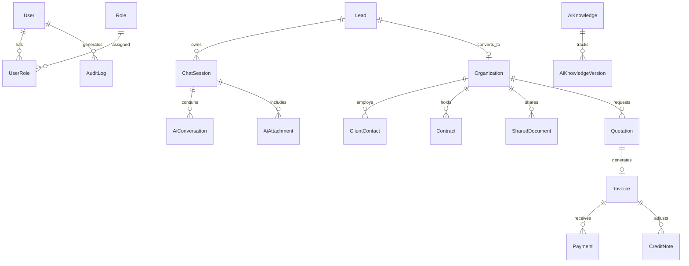

# Denis Business Platform — Database Schema & Architecture Specification

```
Version: 1.0.0
Last Updated: 2026-07-25
Author: Lead Database Architect
Reviewed By: Denis Chamkaga Core Engineering Team
Approval Status: APPROVED (Official Project Standard)
Related Documents: [API_REFERENCE.md](file:///d:/Projects/denis-chamkaga-platform/docs/API_REFERENCE.md), [CRM_ARCHITECTURE.md](file:///d:/Projects/denis-chamkaga-platform/docs/CRM_ARCHITECTURE.md), [DATABASE_SCHEMA.md](file:///d:/Projects/denis-chamkaga-platform/docs/DATABASE_SCHEMA.md)
```

---

## 1. Overview & Connection Architecture

- **ORM Provider:** Prisma (`backend/prisma/schema.prisma`)
- **Database Engine:** PostgreSQL
- **Migration Strategy:** Prisma Migrate (`npx prisma migrate dev`)
- **Primary Keys:** Standardized UUIDs (`@default(uuid())`) or Auto-Increment IDs (`@default(autoincrement())`)

---

## 2. Entity Relationship (ER) Diagram



---

## 3. Core Database Models

### 3.1 Authentication & RBAC Models
- `users`: `id`, `email`, `passwordHash`, `fullName`, `isActive`, `createdAt`, `updatedAt`
- `roles`: `id`, `name` (`ADMIN`, `EDITOR`, `VIEWER`), `description`
- `user_roles`: `userId`, `roleId` (Composite Primary Key)

### 3.2 AI & Conversational Session Models
- `chat_sessions`: `id`, `visitorId`, `leadId`, `score`, `status`, `lastActiveTime`, `createdAt`
- `ai_conversations`: `id`, `sessionId`, `role` (`user` | `assistant`), `content`, `tokens`, `latencyMs`, `createdAt`
- `ai_attachments`: `id`, `sessionId`, `originalName`, `fileUrl`, `mimeType`, `sizeBytes`, `createdAt`

### 3.3 AI Knowledge & Governance Models ([KNOWLEDGE_GOVERNANCE.md](file:///d:/Projects/denis-chamkaga-platform/docs/KNOWLEDGE_GOVERNANCE.md))
- `ai_knowledge`: `id`, `title`, `content`, `category`, `confidenceScore`, `status` (`DRAFT`, `APPROVED`, `INDEXED`), `source`, `createdAt`
- `ai_knowledge_versions`: `id`, `knowledgeId`, `version`, `content`, `changedBy`, `createdAt`

### 3.4 Business CRM & Client Models ([CRM_ARCHITECTURE.md](file:///d:/Projects/denis-chamkaga-platform/docs/CRM_ARCHITECTURE.md))
- `leads`: `id`, `fullName`, `email`, `phone`, `company`, `score`, `tier` (`COLD`, `WARM`, `HOT`), `status`, `createdAt`
- `organizations`: `id`, `name`, `industry`, `billingEmail`, `phone`, `address`, `createdAt`
- `client_contacts`: `id`, `organizationId`, `fullName`, `email`, `phone`, `position`

### 3.5 Finance OS Models
- `quotations`: `id`, `quotationNumber`, `organizationId`, `totalAmount`, `currency`, `status` (`DRAFT`, `SENT`, `APPROVED`), `publicToken`, `validUntil`
- `invoices`: `id`, `invoiceNumber`, `quotationId`, `organizationId`, `totalAmount`, `status` (`UNPAID`, `PARTIAL`, `PAID`), `dueDate`
- `payments`: `id`, `invoiceId`, `amount`, `paymentMethod`, `transactionRef`, `paidAt`

---

## 4. Key Indexes & Constraints

- `chat_sessions`: Index on `(visitorId)`, Index on `(leadId)`
- `ai_conversations`: Index on `(sessionId, createdAt)`
- `leads`: Unique Index on `(email)`, Index on `(score)`
- `quotations`: Unique Index on `(publicToken)`, Unique Index on `(quotationNumber)`
