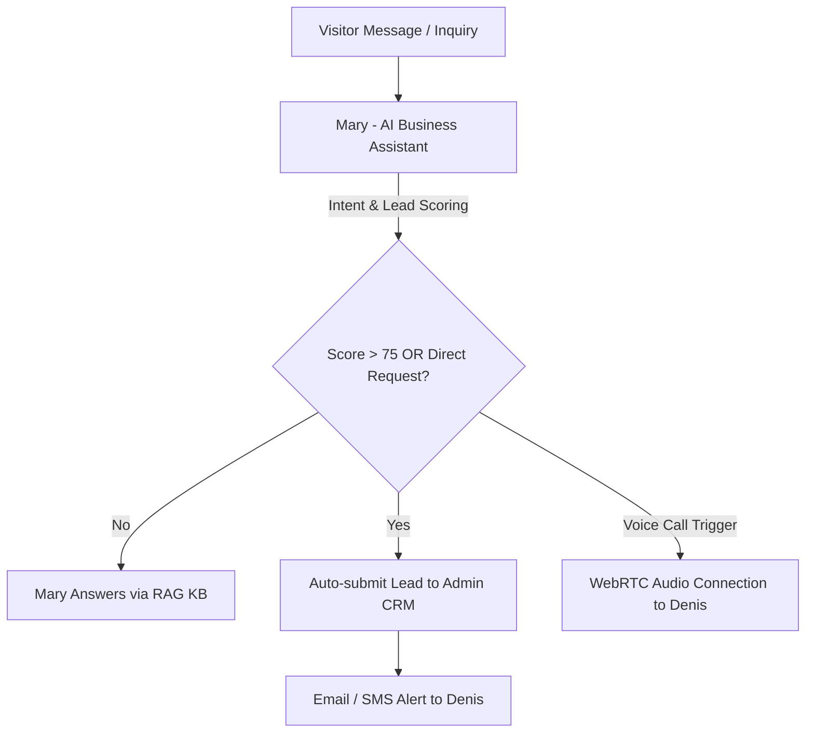

# Denis Business Platform — Denis Assistant Architecture & AI Specification

```
Version: 1.0.0
Last Updated: 2026-07-25
Author: Principal AI Systems Engineer
Reviewed By: Denis Chamkaga Core AI Team
Approval Status: APPROVED (Official Project Standard)
Related Documents: [CHAT_WIDGET_ARCHITECTURE.md](file:///d:/Projects/denis-chamkaga-platform/docs/CHAT_WIDGET_ARCHITECTURE.md), [KNOWLEDGE_GOVERNANCE.md](file:///d:/Projects/denis-chamkaga-platform/docs/KNOWLEDGE_GOVERNANCE.md), [AI_ARCHITECTURE.md](file:///d:/Projects/denis-chamkaga-platform/docs/ai/AI_ARCHITECTURE.md)
```

---

## 1. Purpose & Scope

The **Denis Assistant Ecosystem** powers the entire conversational intelligence of the Denis Business Platform across both the standalone `/denis-assistant` page and the global Floating Chat Widget. It coordinates AI persona execution (Mary), RAG knowledge base retrieval, intent detection, lead scoring, quotation requests, meeting bookings, and direct escalation to Denis Chamkaga.

---

## 2. Personas & Handover Architecture

### 2.1 Mary (AI Business Assistant)
- **Role:** First point of contact for all website visitors.
- **Capabilities:** Speaks Swahili (`sw`) and English (`en`), answers service/portfolio questions, conducts progressive onboarding, calculates project quotes, and scores incoming leads.
- **Guardrails:** Blocked from off-topic discussions (world news, politics, general programming outside Denis's stack).

### 2.2 Denis Chamkaga (Principal & Human Target)
- **Role:** Business principal, lead consultant, and high-value project owner.
- **Handover Triggers:** Triggered when a visitor requests direct consultation, exhibits high lead scores (>75 points), or initiates a WebRTC voice call.



---

## 3. Consultation, Meeting & Quotation Workflows

### 3.1 Consultation Flow
1. Visitor selects "Business Consultation" card or asks a strategic business question.
2. Mary extracts business requirements, industry context, and estimated timeline.
3. Mary generates tailored consultation recommendations and prompts visitor for meeting availability.

### 3.2 Quotation Request Flow
1. Visitor requests a project quote (e.g., "I need a quote for an ERP system").
2. Mary asks clarifying scope questions (features, user count, integrations).
3. System triggers background CRM quotation draft creation and provides indicative budget tiers.

### 3.3 Meeting Booking Flow
1. Visitor chooses "Book a Meeting with Denis".
2. System verifies calendar slot availability via `publicApi` / `calendar` services.
3. Meeting confirmation is saved in database and calendar invite is dispatched.

---

## 4. Knowledge Base & Memory Summarization

- **Knowledge Retrieval (RAG):** Context is pulled dynamically from verified database tables (`projects`, `services`, `faqs`, `ai_knowledge`) before prompt execution.
- **Memory Summarization:** As chat conversations grow beyond 10 turns, the `memory.ts` module generates compact conversational summaries to prevent token inflation while maintaining context state.

---

## 5. WebRTC Direct Voice Calling Architecture

High-intent visitors who complete onboarding can initiate direct audio calls with Denis Chamkaga inside the widget or assistant page:
1. Frontend checks WebRTC status via GET `/api/ai/webrtc/session`.
2. Microphones are requested via `navigator.mediaDevices.getUserMedia({ audio: true })`.
3. PeerConnection is negotiated via ICE candidates sent to POST `/api/ai/webrtc/candidate`.
4. Call completion logs are written to database via POST `/api/ai/webrtc/log`.

---

## 6. Future Development Rules

> [!CAUTION]
> ❌ Do NOT bypass Mary's system prompt guardrails.  
> ❌ Do NOT communicate directly with LLM providers from the browser (all requests flow through backend).  
> ❌ Do NOT alter lead scoring threshold math without updating CRM documentation.
