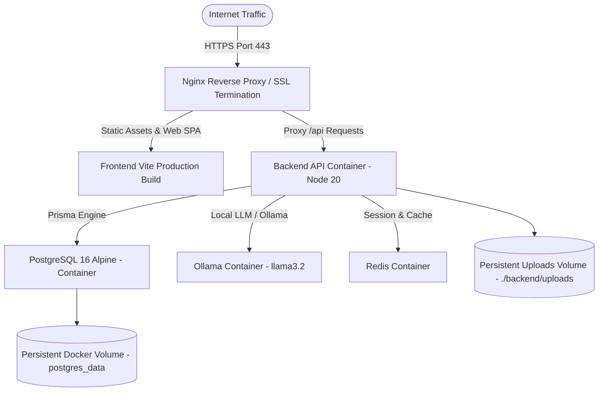

# Denis Business Platform — Deployment Architecture & DevOps Specification

```
Version: 1.0.0
Last Updated: 2026-07-25
Author: Principal DevOps Engineer
Reviewed By: Denis Chamkaga Infrastructure Directorate
Approval Status: APPROVED (Official Project Standard)
Related Documents: [SYSTEM_ARCHITECTURE.md](file:///d:/Projects/denis-chamkaga-platform/docs/SYSTEM_ARCHITECTURE.md), [SECURITY_ARCHITECTURE.md](file:///d:/Projects/denis-chamkaga-platform/docs/SECURITY_ARCHITECTURE.md), [docker-compose.yml](file:///d:/Projects/denis-chamkaga-platform/docker-compose.yml)
```

---

## 1. Overview & Infrastructure Architecture

This specification details the production deployment model, containerization topology, Nginx reverse proxy configuration, SSL termination, PostgreSQL persistence, and health monitoring for the Denis Business Platform ([docker-compose.yml](file:///d:/Projects/denis-chamkaga-platform/docker-compose.yml)).

---

## 2. Production Topology & Container Blueprint



---

## 3. Container Topology Services ([docker-compose.yml](file:///d:/Projects/denis-chamkaga-platform/docker-compose.yml))

### 3.1 Database Service (`postgres`)
- **Image:** `postgres:16-alpine`
- **Health Check:** `pg_isready -U denis -d denis_platform` every 10s.
- **Persistence:** Volume mapping `postgres_data:/var/lib/postgresql/data`.

### 3.2 Backend API Service (`api`)
- **Node Environment:** `production` (Port `5000`)
- **Dependencies:** Waits for `postgres` container to report `service_healthy`.
- **Restart Policy:** `unless-stopped`

### 3.3 Dev Tools Service (`pgadmin`)
- **Image:** `dpage/pgadmin4:latest` (Port `5050`)
- **Profile:** `dev-tools` (Disabled in standalone production).

---

## 4. Nginx Reverse Proxy & SSL Configuration

```nginx
server {
    listen 443 ssl http2;
    server_name denischamkaga.com www.denischamkaga.com;

    ssl_certificate /etc/letsencrypt/live/denischamkaga.com/fullchain.pem;
    ssl_certificate_key /etc/letsencrypt/live/denischamkaga.com/privkey.pem;

    # Gzip Compression
    gzip on;
    gzip_types text/plain text/css application/json application/javascript text/xml;

    location / {
        root /var/www/denis-platform/frontend/dist;
        try_files $uri $uri/ /index.html;
    }

    location /api {
        proxy_pass http://localhost:5000;
        proxy_http_version 1.1;
        proxy_set_header Upgrade $http_upgrade;
        proxy_set_header Connection 'upgrade';
        proxy_set_header Host $host;
        proxy_cache_bypass $http_upgrade;
    }
}
```

---

## 5. Backup & Disaster Recovery

- **Automated Daily DB Backup:** Cron job executes `pg_dump -U denis denis_platform > /backups/db_$(date +%Y%m%d).sql`.
- **Retention:** Backups retained locally for 30 days and synced to encrypted remote storage.
