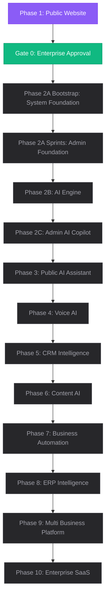

# Development Roadmap

> Denis Chamkaga Portfolio & AI Business Platform · Enterprise Roadmap Spec

---

## 1. Roadmap Overview

The platform development is structured into 10 structured phases, ensuring that each phase builds a secure foundation for the next. The core architecture of Phase 1 is now frozen, serving as the stable baseline for subsequent implementations.

---

## 2. Platform Phases & Status

### 🟣 Phase 1: Public Website (Completed)
*   **Status:** ✅ **COMPLETED & FROZEN**
*   **Scope:** Responsive client interfaces (Home, About, Services, Projects, Blog, Creator, Future Vision, Partner, Contact, Support), multivariant theme controllers, localizations (EN/SW), baseline database schemas, and modular code separations.

### 🟣 Gate 0: Enterprise Baseline Approval (Completed)
*   **Status:** ✅ **COMPLETED & APPROVED**
*   **Scope:** Domain Boundaries, Folder layouts, Provider and Gateway Abstractions, Event Bus conventions, Prisma schemas and indexing models, API response and standard error formatting.

### 🟣 Phase 2A Bootstrap: System Foundation (Completed)
*   **Status:** ✅ **COMPLETED**
*   **Scope:** Scaffolding across `@dc/shared`, `backend`, `frontend`, Logger, Event Bus, Provider interfaces, Navigation engine, and Icon registry without business logic.

### 🟣 Phase 2B: Sprint 1 - Authentication & Identity (Completed & Accepted)
*   **Status:** ✅ **COMPLETED & ACCEPTED**
*   **Scope:** JWT Access & Refresh token rotation/revocation, bcrypt password policy, multi-session management, audit logging, RBAC permission engine, Resend/SendGrid email integration, rate-limiting, and 100% build verification.

### 🟡 Phase 2C: Sprint 2 - Knowledge Platform Foundation (Active)
*   **Status:** 🟡 **ACTIVE DEVELOPMENT**
*   **Scope:** RAG Engine, Knowledge Repository (Documents, Categories, Tags, Versioning), Chunking & Vector/Keyword/Hybrid Search, AI Provider abstraction (OpenAI Primary, Gemini Secondary, Ollama purged), Event Bus integration (`KnowledgeCreated`, `KnowledgeUpdated`, `KnowledgeDeleted`, `EmbeddingGenerated`, `IndexCompleted`), and Admin CMS UI.

### ⚪ Phase 3: Public AI Assistant (Planned)
*   **Status:** ⏳ Pending
*   **Scope:** Public-facing client RAG search widget, FAQ assistant, service and project recommendations, company vision guides, and scheduling modules.

### ⚪ Phase 4: Voice AI (Planned)
*   **Status:** ⏳ Pending
*   **Scope:** Speech-to-text input, text-to-speech output, real-time voice call note-taking, browser-to-browser WebRTC call overlays, and WhatsApp voice message processing.

### ⚪ Phase 5: CRM Intelligence (Planned)
*   **Status:** ⏳ Pending
*   **Scope:** Multi-factor lead qualifying and intent temperature calculations, auto-qualification CRM updates, and intelligent customer relationship follow-up notifications.

### ⚪ Phase 6: Content AI (Planned)
*   **Status:** ⏳ Pending
*   **Scope:** Integrated markdown outline builders, draft generators for blog posts, newsletter builders, social copy publishers, SEO checks, and manual-edit workflows (Human-in-the-loop).

### ⚪ Phase 7: Business Automation (Planned)
*   **Status:** ⏳ Pending
*   **Scope:** Integrated invoicing workflows, automatic billing reminders, transaction receipt generators, ledger entries reconciliation, and Event Bus integration.

### ⚪ Phase 8: ERP Intelligence (Planned)
*   **Status:** ⏳ Pending
*   **Scope:** Integrating foundational ERP modules, inventory management systems, accounting ledger configurations, and asset valuation trackers.

### ⚪ Phase 9: Multi Business Platform (Planned)
*   **Status:** ⏳ Pending
*   **Scope:** Establishing multi-company and branch configurations, multi-tenant databases isolation, and cross-organization integrations.

### ⚪ Phase 10: Enterprise SaaS (Planned)
*   **Status:** ⏳ Pending
*   **Scope:** Tenant subscription billing packages, multi-agent ticket routing, API token marketplaces, and custom developer SDK plugins.
