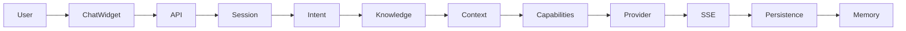
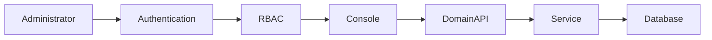
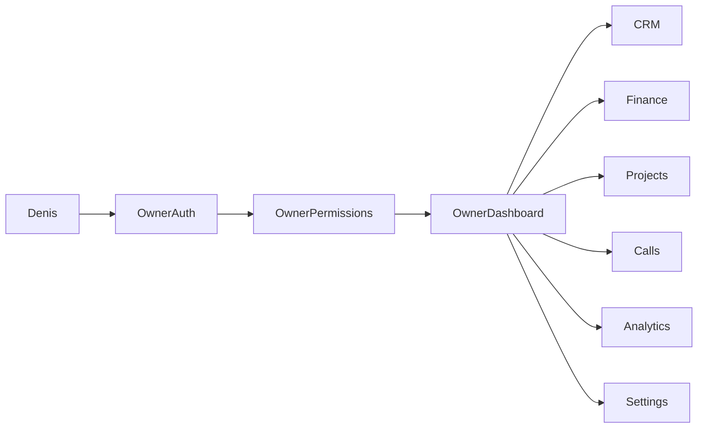

# Final End-to-End Certification — 12 September 2026

## Executive result

**NO-GO**

This certification does not claim production readiness. Database-backed integration suites, security regressions, typecheck, lint, build, deterministic Mary flows, and public browser route coverage pass. Mary live generation fails with OpenAI HTTP 429/no credits. DPO sandbox/webhook and real WebRTC media negotiation have not been demonstrated against external services.

## A. System flow

Local database/service evidence passes for lead intake, CRM synchronization, consultation, quote, invoice, payment posting, receipt, ledger, project creation, milestones, tasks, files, delivery-oriented state, training knowledge, and supporter/customer support records. External payment-provider settlement remains uncertified.

## B. Mary flow

The offline deterministic corpus passes 23/23 turns across six multi-turn scenarios. Dynamic CMS updates reach the final prompt after preserving database-provider relevance scores. Live OpenAI certification fails honestly: provider `openai`, model `gpt-4o-mini`, success 0/1, fallback 1/1, failure `PROVIDER_RATE_LIMITED`, live TTFT unavailable, fallback first token approximately 4.8 seconds, total approximately 5.7 seconds.

No P50/P95/P99 live latency is reported because there is no successful live sample. Fallback timing is not labelled LLM TTFT.

## C. Admin flow

HTTP authentication certification passes 12/12 checks using an isolated temporary super-admin: invalid-password rejection, valid login, access-token issuance, authenticated profile, and refresh rotation. The account and its audit records are removed after the test. Server-side resource/action enforcement has route-level coverage. Browser verification confirmed that the V1 technical Administrator lands on Platform Operations and its navigation excludes Finance, CRM, content, and other owner modules. Owner-only console interaction remains partially certified.

## D. Owner flow

The owner business-flow suite passes all 14 domain assertions through lead, consultation, organization/client, quotation, invoice, payment, receipt, supporter, expense, financial statement, and dashboard telemetry. The legacy runner produced a Windows libuv shutdown assertion after the successful assertions; this is recorded as a test-runner lifecycle defect. Actual owner browser screens are not certified.

## E. Incoming-call flow

Application/API tests verify scoped visitor capability, cross-session rejection, public-answer rejection, administrator-only internal notes, valid state transitions, and persistent call logs. The integrated business suite passes call request and notebook persistence. Two-browser WebRTC media negotiation, microphone permission, ICE exchange, and connected audio were not demonstrated because browser execution is blocked.

## F. Findings

### P0

- **PASS:** Conversation IDOR controls and scoped capabilities.
- **PASS:** Call mutation authorization and internal-note protection.
- **PASS:** Stored HTML XSS sanitization and CSP script hardening.
- **FAIL/BLOCKER:** Live Mary provider is unavailable due HTTP 429.
- **BLOCKED:** Two-context WebRTC media certification.
- **BLOCKED:** External DPO sandbox/webhook certification.

### P1

- **PASS:** Durable/versioned/idempotent Mary memory jobs and deletion-race regression.
- **PASS:** Newest-message context, summaries, confirmed facts, and follow-up reference state.
- **PASS:** Refresh-cookie/CSRF backend flow and token rotation tests.
- **PASS:** Server-side resource/action RBAC implementation.
- **PARTIAL:** Upload magic-byte/private-network controls pass code review and regression; a real malware scanner is not connected.
- **PARTIAL:** Release gates exist; target deployment and post-deploy checks have not run.

### P2/P3

- **PASS:** Targeted Decimal migration and local migration validation.
- **PASS:** Route-level code splitting and measured bundle reduction.
- **PASS:** Dynamic knowledge cache invalidation and prompt propagation.
- **PASS:** Desktop and 390×844 mobile route smoke coverage for the public site, with no horizontal overflow or console errors in the tested matrix.
- **PASS:** Short lazy-route transitions no longer flash a full page spinner; feedback appears after 180 ms only when loading is perceptible.
- **PENDING:** Field Core Web Vitals, tablet coverage, and two generic page titles (`/support`, `/admin/login`).

## G. Performance

The production build records main JavaScript at 232.11 kB raw / 59.26 kB gzip, down from 318.98 kB / 80.07 kB gzip. The general vendor bundle is 233.20 kB / 69.51 kB gzip, down from 517.08 kB / 164.17 kB gzip; spreadsheet code is isolated in a lazy 94.33 kB gzip chunk.

Desktop and 390×844 mobile browser smoke tests covered `/`, `/about`, `/services`, `/projects`, `/blog`, `/gallery`, `/certificates`, `/business-checker`, `/future-vision`, `/creator`, `/partner`, `/contact`, `/faq`, `/support`, and `/admin/login`. Every settled route rendered meaningful content without horizontal overflow; no console warning/error was observed in the route matrix. Field LCP, image transfer, page API latency, backend P50/P95/P99, and query-count profiling remain pending. These missing measurements prevent GO.

## H. Mary quality

| Measure | Result |
| --- | --- |
| Offline deterministic scenarios | 6/6 PASS |
| Offline turns | 23/23 PASS |
| Live provider success | 0/1, FAIL |
| Fallback rate in live certification | 100% |
| Multi-turn context | PASS in deterministic corpus |
| Corrected/deleted-session memory | PASS in regression coverage |
| Dynamic authoritative grounding | PASS after ranking fix |
| Human handoff/business identity | PASS in deterministic corpus |
| Live hallucination/grounding corpus | NOT CERTIFIED |

## I. Security

- IDOR: visitor A cannot read, rename, download, close, or delete visitor B's conversation.
- XSS: scripts, handlers, SVG payloads, JavaScript URLs, and malformed dangerous HTML are removed server-side.
- RBAC: authorization is enforced on APIs through resource/action permissions; active user/role is revalidated.
- Tokens: refresh rotation/revocation, HttpOnly production cookie, SameSite, and CSRF paths are implemented.
- Uploads: extension, MIME, size, magic-byte, quarantine, SVG denial, and remote-import SSRF restrictions are implemented; malware scanning remains a blocker.
- Payments: missing webhook secrets fail readiness/requests, signatures and invoice amount/currency/state are validated; provider replay certification remains pending.
- Calls: capabilities, role restrictions, note protection, and state validation pass regression tests.

## J. Regression

Passing evidence after remediation:

- Typecheck: backend and frontend PASS.
- Strict lint: PASS with zero permitted warnings.
- Production build: PASS.
- Prisma schema/migration status: PASS; four migrations and local database up to date.
- Security suite: PASS.
- Mary offline suite: 23/23 PASS.
- Core integrated business flow: 7/7 phases PASS.
- Visitor/customer scenarios: 13/13 PASS.
- Finance ERP: 13/13 PASS.
- Project workspace: 13/13 PASS.
- Marketing: 12/12 PASS.
- Supporters/collaborators: 17/17 PASS.
- Business acceptance: 9/9 PASS.
- Admin HTTP authentication: 12/12 PASS.
- Dynamic CMS-to-Mary knowledge: PASS.

## K. Remaining blockers

1. Complete the remaining owner/admin mutations, tablet viewport, and two-context call tests in the browser.
2. Fund/enable OpenAI and run a statistically useful live Mary corpus with true P50/P95/P99 TTFT and total latency.
3. Run DPO sandbox initiation, signed webhook, replay, duplicate, invalid amount/currency, failed, and successful payment cases.
4. Complete two-browser real WebRTC media/signaling certification.
5. Connect a real malware scanner and test authorized private downloads.
6. Run target-environment endpoint/database profiling and post-deployment smoke/health checks.
7. Run the dependency vulnerability audit after explicit authorization to transmit dependency metadata to the npm registry.

## Final verdict

**NO-GO**
