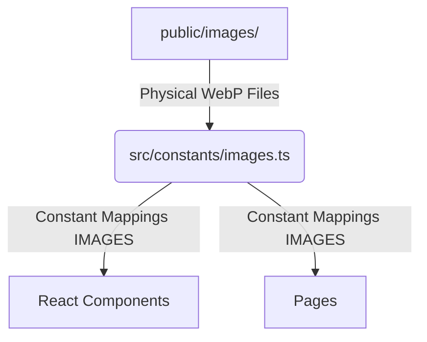
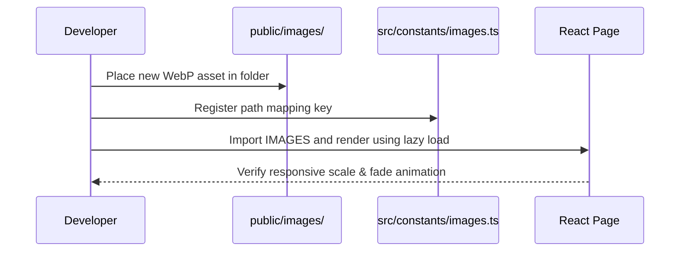

# Image Asset Management Guide

This document details the image architecture, naming conventions, directory structure, replacement guidelines, and asset workflows for the **Denis Chamkaga Portfolio & AI Business Platform**.

---

## 1. Image Architecture

Images on the platform are managed as a centralized, first-class module rather than isolated components. 



- **Single Source of Truth**: All page components consume images via the `IMAGES` constant exported from `src/constants/images.ts`. No relative paths or external URLs should ever be hardcoded inside components.
- **Local Only**: Online image links (e.g., Unsplash/Pexels CDNs) are strictly banned to ensure privacy, performance control, offline capability, and protection against link rot.
- **Bilingual Context**: Image assets remain identical across Swahili and English translations, while their `alt` texts and headings are managed through translations (`src/i18n/en.json` and `src/i18n/sw.json`).

---

## 2. Folder Structure

All physical assets reside inside standard category subfolders under `frontend/public/images/`:

```text
frontend/public/images/
 ├── hero/           # Main landing section portraits & console mockups
 ├── about/          # Profile bio pictures, consulting and university workspace concepts
 ├── timeline/       # Historic work history (Securex, PCCI Group, UDCC studies)
 ├── services/       # Solutions cards (databases, software development, CRM automation)
 ├── projects/       # Previews for School, Library, Hostel, and Inventory systems
 ├── gallery/        # Portfolio photo categories (Professional, Community, Awards, Tech)
 ├── certificates/   # Diplomas and accreditation badges
 ├── assistant/      # Denis Assistant visual intake flow diagrams (CRM rules, lead scoring)
 ├── future/         # Terrasafi T Ltd roadmap concepts (Labs, incubators, team offices)
 ├── backgrounds/    # Site-wide layouts glows (light and dark mode specific)
 ├── placeholders/   # Generic placeholder images and corporate logos
 ├── icons/          # Custom branding icons (non-Lucide)
 ├── testimonials/   # Reference review profile frames
 └── partners/       # Collaborative vendor logos
```

---

## 3. Image Naming Convention

Keep filenames clean, consistent, lowercase, and delimited by underscores:

| Category | Filename Pattern | Example |
| :--- | :--- | :--- |
| **Hero** | `denis_[description].webp` | `denis_portrait.webp` |
| **About** | `[topic]_workspace.webp` | `programming_workspace.webp` |
| **Timeline** | `[milestone_name].webp` | `security_operations.webp` |
| **Services** | `[service_name].webp` | `database_design.webp` |
| **Projects** | `[project_name]_preview.webp` | `school_management.webp` |
| **Gallery** | `[gallery_item].webp` | `university_life.webp` |
| **Certificates** | `[issuer]_[name].webp` | `udcc_diploma.webp` |
| **Assistant** | `[workflow_step].webp` | `lead_qualification.webp` |
| **Future** | `terrasafi_[concept].webp` | `terrasafi_innovation_lab.webp` |

---

## 4. Image Replacement Guide

To replace a placeholder with a real photograph or updated asset:

1. **Format Image**: Prepare the new image file.
   - Size: Keep dimensions under `1200x800` (aspect ratio 4:3 or 16:9 preferred for grid alignment).
   - Format: Convert to **WebP** (recommended quality: 80% to 90% compression).
2. **Replace File**: Save the new WebP file in the appropriate subfolder inside `frontend/public/images/`.
   - Keep the exact same filename as the placeholder to prevent any React code changes.
3. **Verify Layout**: Check the page to verify that the image loads without causing layout shifts or console errors.

---

## 5. Asset Management Workflow

During system maintenance and content expansion, follow this strict pipeline:



- **Performance Checklist**:
  - Always apply `loading="lazy"` on non-hero images to improve page load speed.
  - Set explicit width/height dimensions or use aspect-ratio containers (`aspect-video`, `aspect-square`) to prevent layout shifts (CLS).
  - Use a subtle CSS transition (`transition-transform duration-300 hover:scale-105`) to create a premium feel.

---

## 6. Future Asset Expansion

When expanding the platform (e.g., adding blog posts, team profiles, or product landing pages):

1. Create the new directory subfolder under `public/images/` if none fits the category (e.g., `public/images/blog/`).
2. Register the namespace in `src/constants/images.ts`:
   ```typescript
   export const IMAGES = {
     // ...
     blog: {
       scalingSLA: '/images/blog/scaling_sla_operations.webp',
     }
   } as const;
   ```
3. Fulfill the **Placeholder Policy** by executing a script or creating a temporary grid placeholder inside the path, avoiding broken image tags.
4. Consume `IMAGES.blog.scalingSLA` inside components.
