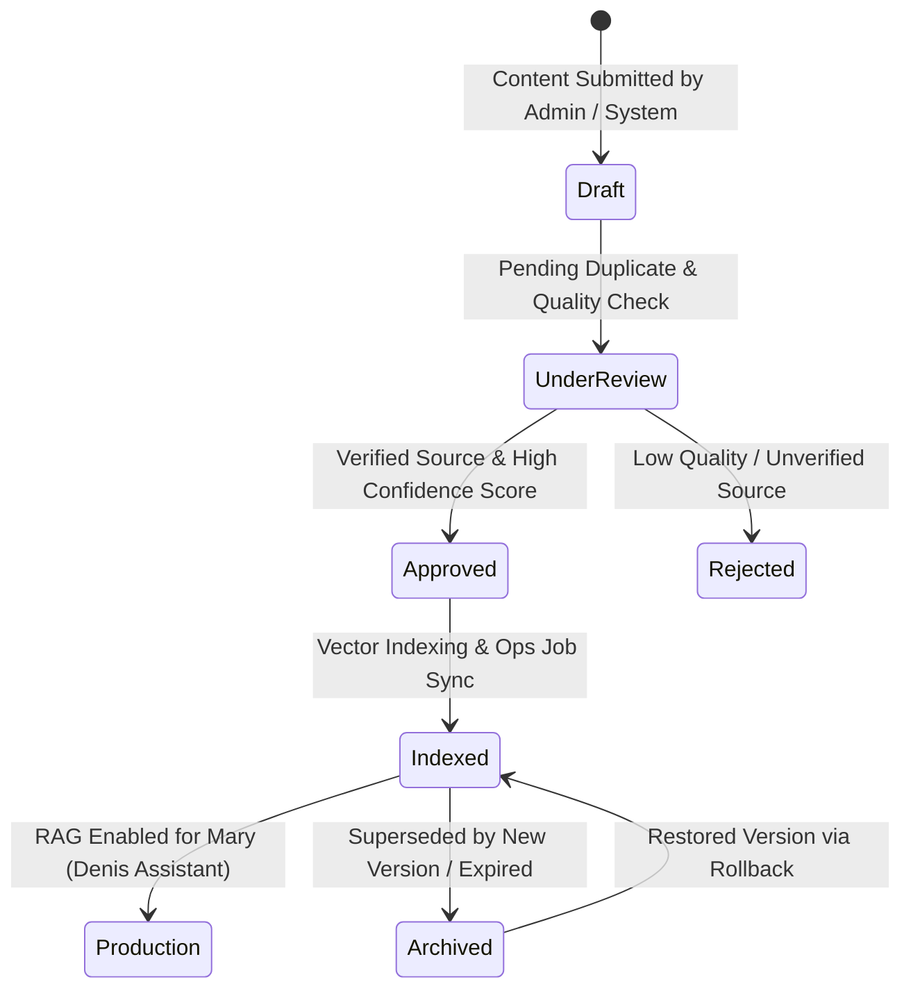

# Denis Business Platform — Knowledge Governance & Data Integrity Specification (Phase 5 Step 5 Foundation)

```
Version: 1.0.0
Last Updated: 2026-07-25
Author: Principal AI Governance Officer
Reviewed By: Denis Chamkaga Core AI & Data Team
Approval Status: APPROVED (Official Project Standard)
Related Documents: [DENIS_ASSISTANT_ARCHITECTURE.md](file:///d:/Projects/denis-chamkaga-platform/docs/DENIS_ASSISTANT_ARCHITECTURE.md), [ADMIN_ARCHITECTURE.md](file:///d:/Projects/denis-chamkaga-platform/docs/ADMIN_ARCHITECTURE.md), [DATABASE_SCHEMA.md](file:///d:/Projects/denis-chamkaga-platform/docs/DATABASE_SCHEMA.md)
```

---

## 1. Purpose & Scope

This specification defines the official **Knowledge Governance & Data Integrity Architecture** for the Denis Business Platform. As the foundational blueprint for **Phase 5 Step 5**, it governs how dynamic knowledge base records are created, verified, versioned, scored, indexed, approved, and pruned to ensure zero AI hallucinations and complete data reliability.

---

## 2. Knowledge Lifecycle & Review Workflow



---

## 3. Core Governance Rules

### 3.1 Versioning & Rollback Architecture
- **Immutable History:** Edits to any AI knowledge entry create a new immutable entry in `ai_knowledge_versions`.
- **One-Click Rollback:** Administrators can restore previous versions instantly via POST `/api/admin/ai-knowledge/:id/restore/:versionId`.

### 3.2 Duplicate Prevention & Confidence Scoring
- System performs semantic duplicate detection before saving new knowledge items.
- Items must achieve a **Confidence Threshold Score ≥ 0.85** to be eligible for production RAG retrieval.

### 3.3 Verification of Data Sources
Every knowledge item must cite an official source category (`PROJECT_PORTFOLIO`, `SERVICE_CATALOG`, `BIOGRAPHY`, `PRICING_STRUCTURE`, `CERTIFICATIONS`, `LEGAL_TERMS`). Unverified entries are blocked from RAG context assembly.

### 3.4 Ops Jobs, Health & Metrics Monitoring
Admin Console monitors AI Knowledge Operations via dedicated health endpoints:
- GET `/api/admin/ai-knowledge/ops/health`
- GET `/api/admin/ai-knowledge/ops/metrics`
- POST `/api/admin/ai-knowledge/reindex`

---

## 4. Future Development Rules

> [!CAUTION]
> ❌ Knowledge items with status `DRAFT` or `REJECTED` MUST NEVER be included in production RAG prompts.  
> ❌ All version rollbacks must be logged with the administrator's ID and timestamp in system audit logs.
