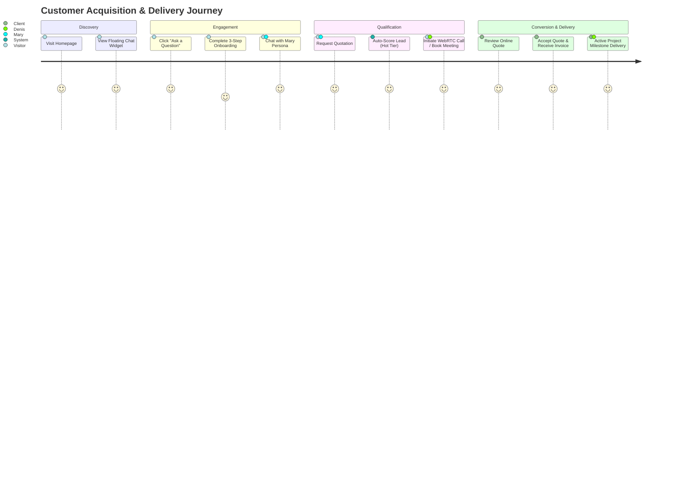

# Denis Business Platform — Product Requirement Document & Product Specification (PRD)

```
Version: 1.0.0
Last Updated: 2026-07-25
Author: Chief Product Officer & Lead Architect
Reviewed By: Denis Chamkaga Steering Committee
Approval Status: APPROVED (Official Project Standard)
Related Documents: [SYSTEM_ARCHITECTURE.md](file:///d:/Projects/denis-chamkaga-platform/docs/SYSTEM_ARCHITECTURE.md), [BUSINESS_RULES.md](file:///d:/Projects/denis-chamkaga-platform/docs/BUSINESS_RULES.md), [README.md](file:///d:/Projects/denis-chamkaga-platform/docs/README.md)
```

---

## 1. Product Purpose & High-Level Vision

The **Denis Business Platform** is an enterprise-grade Digital Business Office designed to showcase Denis Chamkaga's technological credentials, portfolio, and vision while serving as an automated engine for customer acquisition, lead qualification, consultation booking, quotation generation, and client project delivery.

---

## 2. Business Objectives & Core KPIs

### 2.1 Business Objectives
- **Automate Top-of-Funnel Lead Capture:** Replace static contact forms with an interactive, bilingual AI Assistant (Mary) and progressive onboarding.
- **Accelerate Sales Cycle:** Provide instant quotations and online meeting booking for qualified corporate prospects.
- **Enterprise Credibility:** Deliver a visually stunning, glassmorphic UI with micro-animations and zero performance compromises.

### 2.2 Core Key Performance Indicators (KPIs)
- **Visitor Conversion Rate:** % of unique visitors completing the 3-step onboarding flow.
- **Lead Qualification Rate:** % of captured leads reaching "Warm" (Score ≥ 40) or "Hot" (Score ≥ 75) status.
- **AI Response Latency:** First-token SSE stream latency < 800ms.
- **Customer Satisfaction:** Positive feedback rate on AI interactions and consultation bookings.

---

## 3. User Personas

| Persona Name | Primary Role | Key Objectives | Pain Points Addressed |
| :--- | :--- | :--- | :--- |
| **Corporate Executive / Enterprise Client** | CEO / CTO evaluating technology partners | Seeking custom software, ERP/CRM, or mobile app development | Gets immediate, structured project quotes & instant meeting bookings with Denis |
| **Startup Founder / SME Owner** | Business owner seeking digital transformation | Looking for web development, cloud servers, or AI automation | Discovers service tiers and gets instant guidance from Mary Assistant |
| **Tech Collaborator / Recruiter** | Industry peer or partner | Reviewing Denis's resume, certificates, blog, and code credentials | Explores verified credentials, certificates, and interactive timeline |
| **Denis Chamkaga (System Principal)** | Platform Owner & Administrator | Managing incoming leads, client quotes, invoices, and AI knowledge | Oversees all CRM pipelines, revenue telemetry, and AI governance from one console |

---

## 4. End-to-End Customer Journey



---

## 5. System Modules Overview

1. **Public Portfolio Suite:** Landing, About, Services, Projects, Timeline, Gallery, Certificates, Blog, Contact, FAQ, Business Checker, Future Vision.
2. **Interactive AI Suite:** Floating Chat Widget, Mary Assistant Persona, SSE Chat Stream, WebRTC Direct Call.
3. **Admin Command Console:** Telemetry Dashboard, CMS Publishing, CRM Pipeline, Finance OS, AI Knowledge Ops, User RBAC, Audit Logs.
4. **Finance OS Suite:** Tokenized Quotations, Invoices, Online Response Links, Payment Verification.

---

## 6. Product Roadmap Summary

- **Phase 1-4 (Completed):** Platform core, Public layout, AI SSE chat stream, Admin console, Finance OS, WebRTC voice calling.
- **Phase 5 Step 5 (Current):** Enterprise Knowledge Governance, Data Integrity, and Complete Documentation Suite.
- **Future Roadmap (Post-MVP):** Multi-tenant enterprise SaaS expansion, automated AI proposal generation, native iOS/Android mobile client apps.
