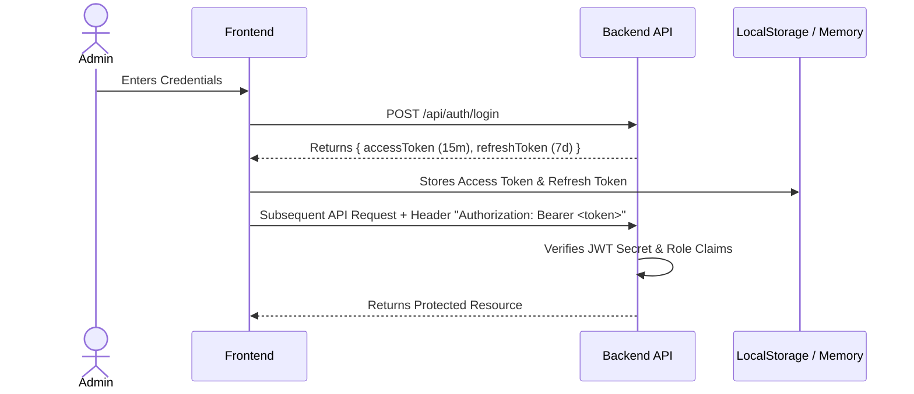

# Denis Business Platform — Security Architecture & OWASP Guardrails Specification

```
Version: 1.0.0
Last Updated: 2026-07-25
Author: Chief Information Security Officer (CISO)
Reviewed By: Denis Chamkaga Security Directorate
Approval Status: APPROVED (Official Project Standard)
Related Documents: [ADMIN_ARCHITECTURE.md](file:///d:/Projects/denis-chamkaga-platform/docs/ADMIN_ARCHITECTURE.md), [API_REFERENCE.md](file:///d:/Projects/denis-chamkaga-platform/docs/API_REFERENCE.md), [DEPLOYMENT_ARCHITECTURE.md](file:///d:/Projects/denis-chamkaga-platform/docs/DEPLOYMENT_ARCHITECTURE.md)
```

---

## 1. Overview & Threat Model

The **Security Architecture** enforces enterprise-grade security standards across the Denis Business Platform, protecting against OWASP Top 10 vulnerabilities, unauthorized access, data leaks, and malicious prompt injections.

---

## 2. Authentication & Token Management



- **Short-Lived Access Tokens:** Expire after 15 minutes.
- **Refresh Token Rotation:** Expiration after 7 days; auto-refreshed via frontend Axios interceptor ([api.ts:L42](file:///d:/Projects/denis-chamkaga-platform/frontend/src/services/api.ts#L42)).

---

## 3. OWASP Vulnerability Safeguards

### 3.1 SQL Injection Protection
- All database queries use **Prisma ORM** with parameterized prepared statements. Raw SQL queries are strictly prohibited.

### 3.2 Cross-Site Scripting (XSS) & Input Sanitization
- All user inputs are sanitized before rendering or sending to AI prompt contexts.
- React automatically escapes rendered strings in JSX.

### 3.3 File Upload Security (`/api/ai/attachments`)
- Allowed File Types: Strictly restricted to `.jpg`, `.jpeg`, `.png`, `.webp`, `.pdf`, `.docx`, `.xlsx`.
- File Size Limit: Maximum **10 MB** per file.
- Storage: Saved with randomized UUID basenames to prevent path traversal attacks.

### 3.4 Rate Limiting & Denial of Service (DoS)
- Express route-level rate limiting (`express-rate-limit`) limits public endpoints to 100 requests per 15-minute window per IP.

---

## 4. System Audit Logs

Destructive operations (user creation, password reset, knowledge base rollback, lead deletion) emit an immutable audit log entry saved in the `audit_logs` database table.
