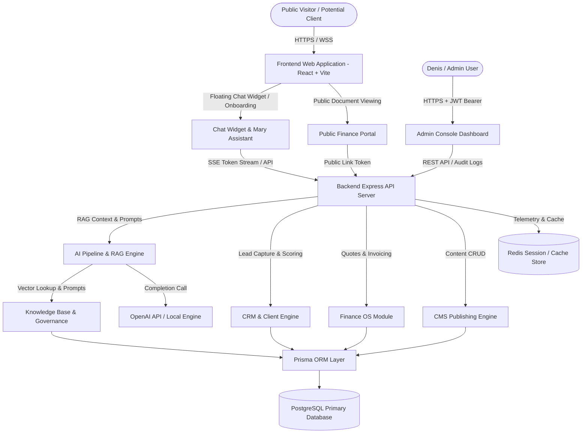

# Denis Business Platform — End-to-End System Architecture Blueprint & Developer Mandate

```
Version: 1.0.0
Last Updated: 2026-07-25
Author: Chief Systems Architect
Reviewed By: Denis Chamkaga Engineering Directorate
Approval Status: APPROVED (Official Project Standard)
Related Documents: [README.md](file:///d:/Projects/denis-chamkaga-platform/docs/README.md), [CHAT_WIDGET_ARCHITECTURE.md](file:///d:/Projects/denis-chamkaga-platform/docs/CHAT_WIDGET_ARCHITECTURE.md), [DENIS_ASSISTANT_ARCHITECTURE.md](file:///d:/Projects/denis-chamkaga-platform/docs/DENIS_ASSISTANT_ARCHITECTURE.md), [ADMIN_ARCHITECTURE.md](file:///d:/Projects/denis-chamkaga-platform/docs/ADMIN_ARCHITECTURE.md), [CRM_ARCHITECTURE.md](file:///d:/Projects/denis-chamkaga-platform/docs/CRM_ARCHITECTURE.md), [API_REFERENCE.md](file:///d:/Projects/denis-chamkaga-platform/docs/API_REFERENCE.md), [DATABASE_SCHEMA.md](file:///d:/Projects/denis-chamkaga-platform/docs/DATABASE_SCHEMA.md)
```

---

## 1. System Vision & Architecture Overview

The **Denis Business Platform** is an integrated AI-driven Digital Business Office. It combines public portfolio showcases, an intelligent customer entry point (Floating Chat Widget & Mary Assistant), RAG knowledge engine, client CRM pipelines, Finance OS, WebRTC voice calling, CMS publishing, and real-time telemetry into a unified architecture.

---

## 2. End-to-End System Blueprint



---

## 3. Technology Stack & Infrastructure

- **Frontend Core:** React 18, TypeScript, Vite, Framer Motion, Lucide Icons, Zustand State Stores.
- **Styling System:** Custom Vanilla CSS + Glassmorphism Tokens ([DESIGN_SYSTEM.md](file:///d:/Projects/denis-chamkaga-platform/docs/DESIGN_SYSTEM.md)).
- **Backend API:** Node.js, Express, TypeScript, Axios, Cors, Helmet, Rate Limiter.
- **Database & ORM:** PostgreSQL, Prisma ORM ([DATABASE_SCHEMA.md](file:///d:/Projects/denis-chamkaga-platform/docs/DATABASE_SCHEMA.md)).
- **AI & RAG Pipeline:** OpenAI API (gpt-4o-mini / custom models), Custom RAG Loader, Vector Indexing ([DENIS_ASSISTANT_ARCHITECTURE.md](file:///d:/Projects/denis-chamkaga-platform/docs/DENIS_ASSISTANT_ARCHITECTURE.md)).
- **Real-Time & Signaling:** Server-Sent Events (SSE) streaming, WebRTC SDP Signaling.

---

## 4. Non-Negotiable Developer Mandate

> [!IMPORTANT]
> **Documentation is part of the product itself, not an optional artifact.**
>
> ### Rules for Future Engineering Contributions:
> 1. **Zero Pull Request Approval Without Documentation:**  
>    Any Pull Request affecting UI components, AI behavior, CRM pipelines, API routes, or Database models **MUST** update its corresponding specification document inside `/docs`.
> 2. **Definition of Done (DoD) Criteria:**
>    - Implementation complete and tested.
>    - Architecture documented in `/docs`.
>    - Wireframes and visual mockups archived in `/docs`.
>    - Interaction flows updated.
>    - Future development rules specified.
> 3. **Preservation of Core Modules:**  
>    The Floating Chat Widget, Mary Assistant persona, Onboarding validation, Admin Console, and CRM pipelines are verified in production and **MUST NOT** be altered without formal architectural sign-off.
