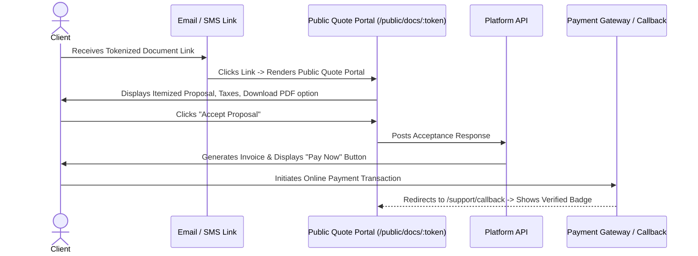
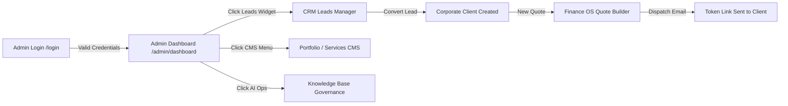

# Denis Business Platform — UI Screen Flow & State Transition Specification

```
Version: 1.0.0
Last Updated: 2026-07-25
Author: Lead UI/UX Engineer
Reviewed By: Denis Chamkaga Design Directorate
Approval Status: APPROVED (Official Project Standard)
Related Documents: [INFORMATION_ARCHITECTURE.md](file:///d:/Projects/denis-chamkaga-platform/docs/INFORMATION_ARCHITECTURE.md), [CHAT_WIDGET_ARCHITECTURE.md](file:///d:/Projects/denis-chamkaga-platform/docs/CHAT_WIDGET_ARCHITECTURE.md), [COMPONENT_LIBRARY.md](file:///d:/Projects/denis-chamkaga-platform/docs/COMPONENT_LIBRARY.md)
```

---

## 1. Overview & Screen Transition Architecture

This specification details the user interface screen wireflows, entry/exit points, state transitions, and modal overlays across public pages, chat interactions, and administrative dashboards.

---

## 2. Public Visitor Screen Flow & Navigation

```mermaid
graph TD
    Landing[Visitor Lands on Homepage /] --> Browse[Scrolls Services & Portfolio]
    Browse -->|Click Chat Trigger| OpenWidget[Widget Home Tab Opens]
    
    OpenWidget -->|Click "Ask a Question"| Onboard1[Onboarding Step 1: Full Name]
    Onboard1 -->|Valid Name| Onboard2[Onboarding Step 2: Email]
    Onboard2 -->|Valid Email| Onboard3[Onboarding Step 3: Phone]
    Onboard3 -->|Valid Phone| ActiveChat[Unlocked Chat with Mary]
    
    ActiveChat -->|Type Query / Attach File| StreamResponse[Mary SSE Stream Token Response]
    ActiveChat -->|Click Voice Call| VoiceCall[WebRTC Voice Call Active Bar]
    
    Browse -->|Click Service Card| ServiceDetail[Services Page /services]
    Browse -->|Click Project Card| ProjectsPage[Projects Page /projects]
    Browse -->|Click Contact Navbar| ContactPage[Contact Page /contact]
```

---

## 3. Public Document Review & Payment Flow



---

## 4. Admin Console Navigation & Workflow



---

## 5. Transition & Overlay Rules

- **Modal Backdrops:** `bg-black/80 backdrop-blur-md` smoothly animated via Framer Motion `opacity` (0 to 1 over 150ms).
- **Toast Notifications:** Slide in from top-right (`y: -20` to `y: 0` over 200ms) with auto-dismiss after 4000ms.
