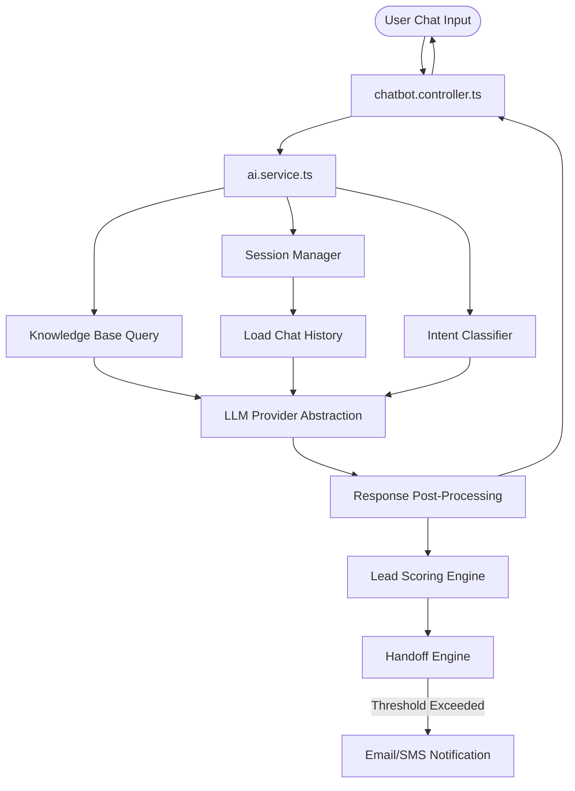

# AI Architecture

> Denis Chamkaga Portfolio & AI Business Platform
> Detailed AI System Architectural Blueprint

---

## 1. System Integration Flow

The AI system functions as an integrated pipeline that consumes user messages, interacts with local/cloud LLM providers, queries memory and knowledge bases, scores user engagement, and triggers transitions or notifications.



---

## 2. Component Blueprint

### 2.1 Chatbot Controller (`chatbot.controller.ts`)
- **Location:** `backend/src/controllers/chatbot.controller.ts`
- **Purpose:** Exposes the `/api/v1/ai/chat` endpoint, sanitizes user input, manages HTTP headers, and handles HTTP response mapping.
- **Rules:**
  - Standardizes the response with the `{ success, data: { sessionId, response, intent, confidence, suggestions, leadScore } }` envelope.
  - Implements route-level rate limiting using `rateLimiter.middleware.ts`.

### 2.2 AI Service (`ai.service.ts`)
- **Location:** `backend/src/services/ai.service.ts`
- **Purpose:** Coordinates the execution of intent detection, knowledge base queries, LLM prompting, lead scoring, and history tracking. It maintains the session token and maps session IDs to conversational streams.

### 2.3 LLM Provider Abstraction (`provider.interface.ts`)
- **Location:** [provider.interface.ts](file:///d:/Projects/denis-chamkaga-platform/backend/src/ai/providers/provider.interface.ts)
- **Purpose:** Decouples core AI modules from specific Large Language Model providers.
- **Provider Strategy:**
  - **Development:** OpenAI + gpt-4o-mini 3 local engine (`AI_PROVIDER=openai`).
  - **Production:** OpenAI GPT (`AI_PROVIDER=openai`).
  - **Configuration:** Provider and model configurations are resolved strictly from environment variables without code modification. Supports standardized health checks returning latency, status, and error logs.

---

## 3. Storage and Cache Model

Conversation states are stored in the database to support dashboard inspection, but active sessions are cached in-memory for low-latency retrieval.

### Active Sessions Cache (Redis or In-Memory Map)
- **Key:** `session:<sessionId>`
- **Value:** JSON object containing:
  - `messages`: Last N chat bubbles (minimized context).
  - `leadProfile`: Name, email, phone, company, and budget details extracted so far.
  - `intentHistory`: Array of detected intents to identify conversational loops.
  - `score`: Current numerical lead score.
- **TTL:** 24 hours of inactivity.

### Database Persistence (PostgreSQL via Prisma)
Active sessions write back to the database asynchronously on each message transaction:
- `chat_sessions`: Stores session identifiers, visitor metadata, overall lead score, status, and timestamps.
- `ai_conversations`: Stores each individual prompt and response, token counts, processing latency, and intent classifications.

---

## 4. LLM Provider Strategy

### Development Environment
- **Provider:** OpenAI
- **Model:** gpt-4o-mini
- **Purpose:** 
  * Local development.
  * Testing.
  * Architecture validation.
  * Feature development without API usage costs.

### Production Environment (Current Roadmap)
- **Provider:** OpenAI API
- **Purpose:** 
  * Production visitor conversations.
  * Reliable response performance.
  * Scalable AI execution.
- **Configuration:** The production model must remain configurable through `OPENAI_MODEL` configuration. No model name should be permanently fixed inside the source code. The production provider can be changed in the future through the existing LLM Provider Interface without modifying the AI Core. No additional providers are required for the current roadmap.

---

## 5. Core Architectural Principles

### Provider Independence
AI Core must never depend on a specific LLM provider. AI Core communicates only through the `LLM Provider Interface` and must never import provider-specific implementations.

### Knowledge Source Separation
Business knowledge must originate from the `Knowledge Engine`. Business information must not be hardcoded inside prompts, workflows, provider implementations, or AI Core logic.

### Prompt Builder Responsibility
Prompt Builder must only assemble AI context. Prompt Builder must not contain business rules, scoring logic, workflow decisions, permissions, or provider-specific behaviour.

### Memory Engine Independence
Memory Engine must remain independent from the selected LLM provider. Memory logic must work regardless of whether the active provider is OpenAI, OpenAI, or another compatible provider.

### Knowledge Engine Independence
Knowledge Engine must remain independent from the LLM provider. Knowledge retrieval must continue working without changes to AI Core when changing providers.

### Workflow Independence
Workflow Engine and Tool Execution Engine must remain independent from provider implementations. Provider changes must not modify workflow behaviour.

### Adding Future Providers
Adding another provider should require only:
1. Implementing the existing LLM Provider Interface.
2. Registering the provider.
3. Updating configuration.
No AI Core modification should be required.

---

## 6. Architecture Version

```
Architecture Version:
Version: 1.1
Status: Sprint 2 Complete (Production-Ready Call Handoff & CIR Redesign)
Sprint: Sprint 2 Complete
Next Milestone: Production Deployment
```

---

## 7. Architecture Freeze Notice

Sprint 1 & Sprint 2 architectures are officially approved as the baseline foundation. Future development must extend the existing architecture rather than redesigning foundational components.

The following components require explicit architectural approval before structural changes:
- AI Core
- LLM Provider Interface
- Context Manager
- Memory Engine
- Knowledge Engine
- Workflow Architecture
- Tool Execution Architecture
- Event Bus
- Call Integration & CIR Architecture

Sprint 3 and future development should focus on implementation quality, testing, performance, security, usability, business functionality, and production readiness. Architecture changes should only occur when a critical production requirement cannot be solved through existing extension points.

---

## 8. Backward Compatibility

All future enhancements must preserve compatibility with the approved Sprint 1 & 2 architectures. New functionality should be introduced through existing extension points whenever practical.

Future development must avoid breaking:
- existing public AI behaviour,
- admin workflows,
- database compatibility,
- existing APIs,
- event flows,
- provider abstraction,
- CIR & Call Sync pipeline.

---

## 9. Customer Journey Handoff & Customer Interaction Record (CIR)

Sprint 2 establishes an AI-to-human call handoff system focused on the customer lifecycle rather than WebRTC protocol details.

### 9.1 Gated Call Entry
- Visitors are gated from calling Denis until the AI chatbot collects/infers key fields (name, email, company, current page, requested service, budget, timeline, urgency) resulting in a lead score of $\ge 50$ or a "warm"/"hot" lead temperature grade.

### 9.2 Pre-Call Customer Brief
- When a call is requested, the system automatically uses the preceding chat session context to generate a structured pre-call **Customer Brief** containing:
  - Customer Profile, budget, timeline, page of interest, and chat duration.
  - Bulleted pain points and business goals.
  - AI-recommended sales approach and a suggested opening quote sentence for Denis.
- The brief is displayed directly on the admin incoming ringing screen.

### 9.3 Post-Call Review & Human-Approved CRM Sync
- During the call, Denis captures rough notes. Upon hangup, the system transitions to a `summary_pending` state, displaying a review panel.
- Clicking **"Generate CRM Summary"** invokes an LLM to consolidate the conversation history, pre-call brief, and raw notes into a structured analysis.
- Denis reviews and edits any of the generated fields (budget, timeline, profile, actions, recommended services) in the UI.
- Clicking **"Approve & Sync to CRM"** saves the approved record, updates the `Lead` database profile, updates the visitor's long-term memory in `aiMemory`, logs a chronology feed event, and triggers background follow-up tasks via the decoupled Automation Engine.
